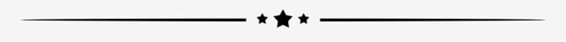

#ReactJs - Comision 34825 utilizando Create ReactApp 
<center></center>


<div>
<p style = 'text-align:center;'>

</p>
</div>

## Nombre:
*ArtDesing*

<div>
<p style = 'text-align:center;'>

</p>
</div>

## Descripción:
Este proyecto fue realizado utilizando Create React App. Es un proyecto basado en la venta de posters para cuadros.

Para poder ejecutar el proyecto debes tener instalado `node` en tu computadora.

Luego debes instalar los paquetes de **Create React App** `npx-create-react-app "nombre de tu carpeta"`

En el directorio de tu proyecto, debes ejecutar:

### `npm start`

Se abrirá tu aplicación en tu navegador [http://localhost:3000](http://localhost:3000)


- La aplicación cuenta con una página de inicio.
- Una sección de **Productos** al que puedes acceder a todas las láminas disponibles.
- Luego te encontrarás con una sección **Categorias** enla que podrás encontrar las dos categorías disponibles:
  1. Amor
  2. Flores
- y finalizamos con el carrito que puede estar vacío indicando que puedes comenzar a comprar o te mostrará los posters seleccionados, la cantidad elegida, el precio y su imagen correspondiente.
- puedes seguir agregando productos, vaciar el carrito o puedes finalizar la compra...
- De haber seleccionado el boton finalizar compra, te llevará para completar un formulario con tu nombre, email y un mensaje. Los campos se deben completar.
- Seleccionando el boton **enviar** mostrará un mensaje final con el número de tu producto seleccionado. Invitandote nuevamente a seguir comprando.


<div>
<p style = 'text-align:center;'>

</p>
</div>

## Documentación:

## Almacenamiento:

LocalStorage

## Base de datos NoSQL:

- Firebase

## Componentes de la aplicación:

1. En el archivo **index.js** importamos Firebase que contiene el archivo **config** y dentro de este se encuentran los datos de la App.
Además importamos App, que contiene toda la información y los componentes del proyecto.
**react-router-dom**  nos permite navegar a los siguientes componentes : Inicio (pagina principal), ItemListContainer (Productos), Categorias (que se encuentra dentro del componente ItemListContainer, que nos permite filtrar por rango de precio.), ItemDetailContainer (que nos permite ver el detalle del producto.), Cart (carrito de compras) y CheckOut (formulario de compra.)

``` 
import React from 'react';
import ReactDOM from 'react-dom/client';
import App from './App';
import './firebase/config'

const root = ReactDOM.createRoot(document.getElementById('root'));
root.render(
  < >
    <App/>
  </>

)

``` 
2. ItemListContainer: muestra las categorias de los productos. Se utiliza el  Hook de useEffect y se hace filtrado por categorias.
3. ItemDetailContainer: importa los datos de firebase utiliza los Hook useParams, useState y useEffect renderizando a ItemDetail que contiene los productos con su imagen, titulo, precio, contenido y cantidad seleccionada a través de los botones correspondientes.
4. ItemDetail, Item e ItemList: son componentes presentacionales, son los encargados de mostrar los productos en la Web.
5. Por medio del método map, iteramos a través de los elementos de la colección que se encuentran en ItemList y mostramos los productos.
6. Item contiene toda la información del producto y con el botón detalle, renderiza a Item con su respectiva key.

``` 
const  ItemList  = ({prod})=> {
  return (
    <div className='item'>
      {prod.map(prod=><Item prod = {prod} key = {prod.id}/>)}

    </div>
  )
  };

  export default ItemList;

  ``` 
  ## Contexto:
  Es muy importante, ya que contiene todas las funciones para hacer funcionar un carrito de compras de una App  a través de CartProvider.

  A través de la función addProduct, podemos saber que producto se agrego en CartWidget (carrito), que cantidad y su precio.

  ## Checkout: 
  Es un formulario  que solicita datos al usuario antes de finalizar la compra. Los datos ingresados son guardados  en el localStorage y en fireStore, creando una colleccion llamada "compra". Al enviar el formulario se ejecutará la función ClearCart, reseteando el formulario y enviando todos estos datos a fireStore.

## Visuales:


<div>
<p style = 'text-align:center;'>

</p>
</div>

## Dependencias Instaladas:
1. `NodeJs`
2. `npx-create-react-app "nombre de tu carpeta"`
3. `npm i`(para instalar los módulos)
4. `toastify-js - npm` ( Biblioteca de Notificaciones)
5. `react-spinners - npm` (spinners de carga)
6. `npm install react-bootstrap bootstrap` React-Bootstrap


<div>
<p style = 'text-align:center;'>

</p>
</div>

## Hoja de ruta:

si tienes buenas ideas para futuras versiones, es una buena idea incluirlas en el README.

<div>
<p style = 'text-align:center;'>

</p>
</div>

## Agradecimientos:

- Principalmente al profesor Félix Blanco por todo lo explicado en cada una de las clases y de los after.
- A mi familia, por todo el apoyo durante todo este tiempo de estudio.
- A mis compañeros de la cursada.

María Eugenia Grande.
